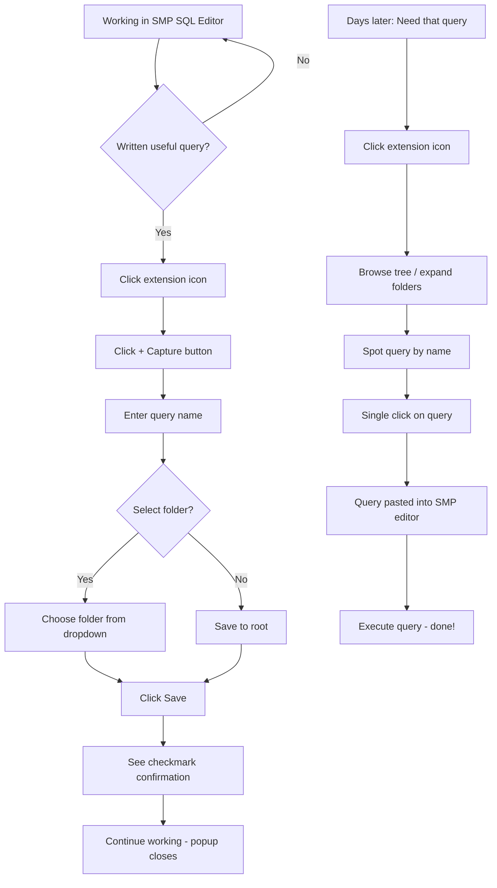
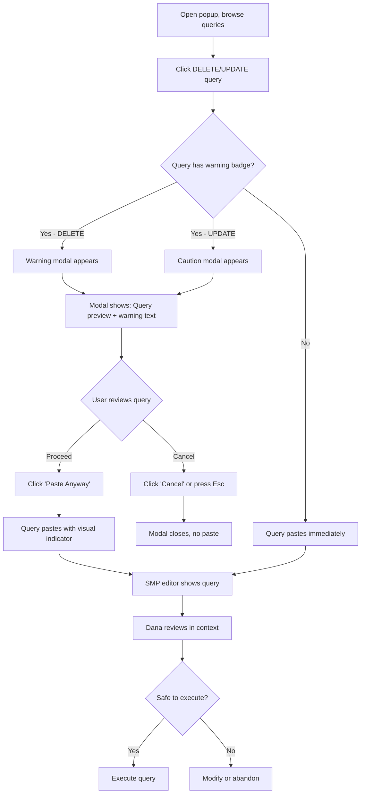
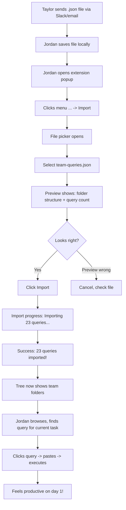
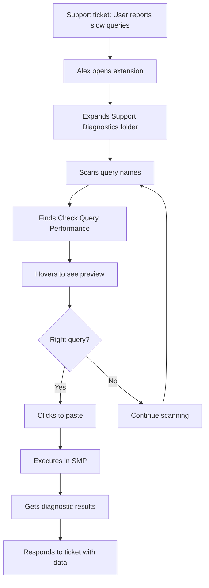
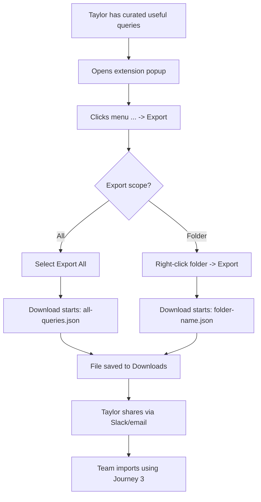

# UX Design Specification - IRIS Query Manager

**Author:** Developer
**Date:** 2026-01-20

---

## Executive Summary

### Project Vision

**IRIS Query Manager** is a Chrome extension that integrates directly with the InterSystems IRIS System Management Portal (SMP) to help developers save, organize, and retrieve SQL queries. The extension transforms a daily pain point - hunting for or rewriting queries - into a moment of relief through one-click capture and paste with hierarchical organization.

### Target Users

| Persona | Role | Primary Need | Tech Level |
|---------|------|--------------|------------|
| **Sam (Solo Dev)** | Mid-level IRIS developer | Personal query library, fast retrieval | High |
| **Dana (DBA)** | Senior production DBA | Safety warnings, careful execution | High |
| **Jordan (Newcomer)** | Junior developer | Team query packs, learning tool | Medium |
| **Alex (Support)** | L2 support technician | Run pre-built queries, self-service | Low-Medium |
| **Taylor (Team Lead)** | Team lead | Knowledge sharing, backup/export | High |

### Key Design Challenges

1. **Popup Space Constraints** - Chrome extension popups have limited real estate; need efficient tree navigation and query preview in compact space

2. **Two-Context Workflow** - Users interact with both the popup AND the SMP page; need seamless handoff between extension popup and page injection

3. **Safety Without Friction** - Destructive query warnings must be noticeable enough to prevent mistakes but not so annoying they get dismissed without reading

4. **First-Time Capture Experience** - The first query capture needs to feel immediately valuable and establish the habit loop

5. **Import/Export UX for Non-Devs** - Support staff need simple import flow; can't be intimidating

### Design Opportunities

1. **Instant Gratification** - One-click capture with visual confirmation creates immediate value perception

2. **Trust Building** - Safety warnings can become a beloved feature that builds trust rather than an annoyance

3. **Team Onboarding** - Import flow can be a "magic moment" for new team members receiving curated query packs

4. **Invisible Infrastructure** - Best UX is when extension becomes invisible - always there when needed, never in the way

## Core User Experience

### Defining Experience

**Primary User Action:** Browse library → Find query → Paste

**Critical Action to Nail:** The first capture. If capture feels instant and rewarding, users build a library. Without a library, there's nothing to retrieve.

**The Capture-Retrieve Loop:**
```
Capture (occasionally) → Library grows → Retrieve (frequently) → Value compounds
```

### Platform Strategy

| Aspect | Decision | Rationale |
|--------|----------|-----------|
| **Platform** | Chrome Extension (Manifest V3) | Lives where users already work |
| **Input Mode** | Mouse-first, keyboard-friendly | Developer tool; support both workflows |
| **Main UI Surface** | Extension popup (~400px wide max) | Chrome constraint; must be efficient |
| **Secondary UI** | Page injection (warnings, status) | Safety warnings appear in context |
| **Offline** | Not needed | SMP requires network anyway |

### Effortless Interactions

| Interaction | Should Feel Like... |
|-------------|---------------------|
| **Capture Query** | One click and done - instant confirmation |
| **Find Query** | Scan tree, spot name, click - 3 seconds max |
| **Paste Query** | Click and it's there - no copy-paste dance |
| **Create Folder** | Right-click or button, type name, enter |
| **Import Pack** | Select file, see queries appear, done |

### Critical Success Moments

| Moment | Why It's Make-or-Break |
|--------|------------------------|
| **First Capture** | If it doesn't feel instant and valuable, habit never forms |
| **First Retrieval** | The "aha!" moment - found a query in 3 seconds that would have taken 10 minutes |
| **Safety Warning** | The moment the warning catches a mistake builds trust forever |
| **Team Import** | New team member imports pack and feels empowered, not overwhelmed |

### Experience Principles

1. **Instant Gratification** - Every action provides immediate, visible feedback. No waiting, no wondering if it worked.

2. **Zero Cognitive Load** - The interface should be scannable, not readable. Users find queries by recognition, not recall.

3. **Safety as Feature** - Warnings are helpful guardrails, not annoying interruptions. Users should appreciate them.

4. **Invisible When Working** - The best state is when users don't think about the extension - they just use it.

## Desired Emotional Response

### Primary Emotional Goals

| Emotion | When It Happens | Why It Matters |
|---------|-----------------|----------------|
| **Relief** | Finding a query you would have rewritten | This is the core emotional payoff - the "worth it" moment |
| **Trust** | Safety warning catches a mistake | Builds long-term relationship, especially for DBAs |
| **Confidence** | Successfully using shared query pack | Empowers newcomers and support staff |
| **Calm Efficiency** | Daily use without thinking about it | Extension becomes invisible infrastructure |

**The Signature Emotion:** Relief. The moment of "thank god I saved that" is what makes users evangelists.

### Emotional Journey Mapping

| Stage | Target Emotion | Design Approach |
|-------|----------------|-----------------|
| **First Discovery** | Curiosity + Hope | "This might solve my problem" |
| **First Capture** | Instant Gratification | Clear confirmation, feels like it worked |
| **Building Library** | Growing Confidence | Watch your collection grow, feel organized |
| **First Retrieval** | Relief + Delight | The "aha!" moment that validates everything |
| **Daily Use** | Calm Efficiency | Extension fades into background |
| **Error/Warning** | Protected, Not Annoyed | Grateful for the guardrail |
| **Team Sharing** | Generosity + Connection | Feel good about helping colleagues |

### Micro-Emotions

| Micro-Emotion | Positive State | Negative State to Avoid |
|---------------|----------------|-------------------------|
| **Capture Moment** | Confident it saved | Anxious if it worked |
| **Finding Query** | Recognition ("there it is!") | Confusion (lost in tree) |
| **Paste Action** | Seamless flow | Interrupted by extra steps |
| **Warning Modal** | Protected, grateful | Annoyed, dismissive |
| **Import Process** | Empowered | Overwhelmed by options |

### Design Implications

| Emotional Goal | UX Design Approach |
|----------------|-------------------|
| **Relief** | Instant visual feedback on capture; clear tree navigation |
| **Trust** | Warning modal shows query preview; cancel is easy; no dark patterns |
| **Confidence** | Import shows what you're getting; folder structure is visible |
| **Calm Efficiency** | Minimal clicks; no unnecessary confirmations; muscle memory friendly |

### Emotional Design Principles

1. **Celebrate Success Quietly** - Confirmations should be visible but not interruptive. A checkmark that fades, not a modal that blocks.

2. **Warnings as Help, Not Interruption** - Safety warnings should feel like a friend tapping your shoulder, not a bouncer blocking the door.

3. **Trust Through Transparency** - Always show what will happen before it happens. No surprises.

4. **Empowerment Over Dependence** - Users should feel capable, not reliant on the tool. The tool makes them better, not dependent.

## UX Pattern Analysis & Inspiration

### Inspiring Products Analysis

#### 1. Password Managers (1Password, Bitwarden)

**Why Relevant:** Same popup-based quick-access pattern

| UX Success | Lesson for Query Manager |
|------------|--------------------------|
| One-click fill | One-click paste pattern |
| Instant search | Future search feature model |
| Visual item differentiation | Query type indicators |
| Keyboard shortcuts | Power user acceleration |

**Key Pattern:** Popup opens → immediate access to items → one action to use

#### 2. Code Snippet Managers (SnippetsLab, Dash)

**Why Relevant:** Exact same capture-organize-retrieve workflow

| UX Success | Lesson for Query Manager |
|------------|--------------------------|
| Syntax highlighting | Query preview readability |
| Folder/tag organization | Tree structure validation |
| Quick capture shortcuts | Capture acceleration |
| Snippet preview on hover | Query preview before paste |

**Key Pattern:** Library grows over time → becomes indispensable reference

#### 3. Chrome Bookmarks (Built-in)

**Why Relevant:** Same platform, similar organization paradigm

| UX Success | Lesson for Query Manager |
|------------|--------------------------|
| Folder tree navigation | Proven mental model |
| Drag-drop organization | Expected interaction |
| Simple right-click menu | Standard Chrome UX |
| One-click to use | Minimal friction pattern |

**Key Pattern:** Users already know how to navigate folder trees

### Transferable UX Patterns

#### Navigation Patterns

| Pattern | Source | Application |
|---------|--------|-------------|
| **Collapsible tree view** | File explorers, bookmarks | Folder organization |
| **Search-as-you-type** | 1Password, VS Code | Future search (v1.1) |
| **Hover preview** | Code editors, file managers | Query preview without clicking |

#### Interaction Patterns

| Pattern | Source | Application |
|---------|--------|-------------|
| **One-click primary action** | Password managers | Paste query instantly |
| **Right-click context menu** | Chrome bookmarks | Rename, delete, move |
| **Drag-drop reorder** | Every file manager | Move queries between folders |
| **Confirmation only when dangerous** | macOS Trash | Only warn for destructive queries |

#### Visual Patterns

| Pattern | Source | Application |
|---------|--------|-------------|
| **Monospace for code** | Code editors | Query text display |
| **Warning colors (amber/red)** | System dialogs | Destructive query warnings |
| **Checkmark confirmation** | iOS, macOS | Subtle save confirmation |
| **Folder icons** | Every file system | Visual hierarchy |

### Anti-Patterns to Avoid

| Anti-Pattern | Why It Fails | Our Approach |
|--------------|--------------|--------------|
| **Modal confirmations for every action** | Creates fatigue, users dismiss without reading | Only warn for destructive queries |
| **Deep folder nesting (5+ levels)** | Users get lost | Recommend 2-3 levels max |
| **Tiny click targets** | Frustrating, especially in small popup | Adequate padding on tree items |
| **Auto-playing animations** | Distracting in a utility tool | Static UI, subtle transitions |
| **Required fields for capture** | Adds friction to core action | Name required, folder optional |

### Design Inspiration Strategy

**What to Adopt Directly:**
- Tree navigation from Chrome bookmarks - proven mental model
- One-click action from password managers - minimal friction
- Confirmation checkmark from iOS - subtle success feedback
- Context menu from Chrome - standard right-click behavior

**What to Adapt:**
- Snippet preview from code managers → Adapt for SQL in compact popup space
- Warning dialogs from OS → Lighter touch, show query preview inline
- Keyboard shortcuts from power tools → MVP optional, v1.1 focus

**What to Avoid:**
- Complex onboarding flows - just let them start capturing
- Feature-heavy UI - keep popup minimal and focused
- Sync complexity - local storage is enough for MVP

## Design System Foundation

### Design System Choice

**Selected Approach:** Native CSS with Design Tokens

For IRIS Query Manager, we're using **Native CSS** with a structured set of **design tokens** (CSS custom properties) rather than a heavy framework.

### Rationale for Selection

| Factor | Decision Rationale |
|--------|-------------------|
| **Lightweight** | No framework overhead in a popup that needs to load instantly |
| **Chrome-Native Feel** | Users expect extensions to feel like Chrome, not a separate app |
| **Minimal Dependencies** | Easier long-term maintenance for solo developer |
| **Sufficient for Scope** | Tree view, buttons, modals are simple enough without a framework |

### Design Tokens

```css
:root {
  /* Colors */
  --color-primary: #4285f4;
  --color-danger: #ea4335;
  --color-warning: #fbbc04;
  --color-success: #34a853;
  --color-text: #202124;
  --color-text-secondary: #5f6368;
  --color-bg: #ffffff;
  --color-border: #dadce0;

  /* Spacing */
  --space-xs: 4px;
  --space-sm: 8px;
  --space-md: 16px;
  --space-lg: 24px;

  /* Typography */
  --font-family: -apple-system, BlinkMacSystemFont, 'Segoe UI', Roboto, sans-serif;
  --font-mono: 'SF Mono', 'Monaco', 'Inconsolata', monospace;
}
```

### Implementation Approach

| Component | Implementation |
|-----------|---------------|
| **Tree View** | Native HTML details/summary or custom collapsible divs |
| **Buttons** | Simple styled buttons with hover/active states |
| **Icons** | Inline SVGs or lightweight icon set (Feather Icons) |
| **Modal (Warning)** | Native dialog element or simple overlay |
| **Forms** | Native inputs with consistent styling |

### Customization Strategy

| Phase | Approach |
|-------|----------|
| **MVP** | System fonts, Chrome-like colors for instant familiarity |
| **V1.1** | Optional dark mode support |
| **Future** | Design tokens make theming easy if IRIS branding needed |

## Visual Design Foundation

### Color System

| Role | Color | Hex | Usage |
|------|-------|-----|-------|
| **Primary** | Google Blue | `#4285f4` | Interactive elements, selected states |
| **Danger** | Google Red | `#ea4335` | Destructive query warnings, errors |
| **Warning** | Google Yellow | `#fbbc04` | Caution states, attention needed |
| **Success** | Google Green | `#34a853` | Confirmations, save indicators |
| **Text Primary** | Near Black | `#202124` | Body text, headings |
| **Text Secondary** | Gray | `#5f6368` | Descriptions, metadata |
| **Background** | White | `#ffffff` | Main surfaces |
| **Border** | Light Gray | `#dadce0` | Dividers, input borders |
| **Hover** | Light Blue | `#e8f0fe` | Tree item hover states |

**Color Rationale:** Chrome-native palette ensures the extension feels like a first-party browser tool, not a third-party add-on. Users trust familiar colors.

### Typography System

| Element | Font | Size | Weight | Line Height |
|---------|------|------|--------|-------------|
| **Popup Header** | System Sans | 16px | 600 | 1.4 |
| **Folder Name** | System Sans | 14px | 500 | 1.3 |
| **Query Name** | System Sans | 13px | 400 | 1.3 |
| **Query Preview** | Monospace | 12px | 400 | 1.4 |
| **Warning Text** | System Sans | 14px | 500 | 1.5 |
| **Button Text** | System Sans | 13px | 500 | 1.0 |

**Font Stack:**
```css
--font-family: -apple-system, BlinkMacSystemFont, 'Segoe UI', Roboto, sans-serif;
--font-mono: 'SF Mono', 'Monaco', 'Inconsolata', 'Consolas', monospace;
```

**Typography Rationale:** System fonts load instantly (zero FOIT), feel native to OS, and ensure optimal rendering. Monospace for SQL maintains code readability.

### Spacing & Layout Foundation

**Base Unit:** 4px (half-unit: 2px)

| Token | Value | Usage |
|-------|-------|-------|
| `--space-xs` | 4px | Icon padding, tight gaps |
| `--space-sm` | 8px | Between inline elements |
| `--space-md` | 16px | Section padding, card margins |
| `--space-lg` | 24px | Major section breaks |

**Layout Specifications:**

| Component | Dimension | Rationale |
|-----------|-----------|-----------|
| **Popup Width** | 360px | Comfortable tree navigation without scroll |
| **Popup Max Height** | 500px | Shows ~12 tree items visible |
| **Tree Item Height** | 32px | Touch-friendly, scannable |
| **Tree Indent** | 16px | Clear hierarchy without deep nesting waste |
| **Button Min Width** | 64px | Adequate tap target |

**Layout Principles:**
1. **Vertical Rhythm** - All spacing multiples of 4px for visual harmony
2. **Compact Efficiency** - No wasted space in limited popup real estate
3. **Scannable Density** - Enough breathing room to distinguish items, tight enough to show many

### Accessibility Considerations

| Requirement | Implementation |
|-------------|----------------|
| **Color Contrast** | All text meets WCAG AA (4.5:1 minimum) |
| **Focus Indicators** | 2px outline on keyboard focus, visible on all backgrounds |
| **Touch Targets** | 32px minimum height for all interactive elements |
| **Motion** | Respect `prefers-reduced-motion`; fade transitions only |
| **Screen Readers** | Semantic HTML, ARIA labels for icon-only buttons |

**Contrast Ratios:**
- `#202124` on `#ffffff`: 14.1:1 (AAA)
- `#5f6368` on `#ffffff`: 5.9:1 (AA)
- `#ea4335` on `#ffffff`: 4.5:1 (AA)

## Design Direction Decision

### Design Directions Explored

Six distinct visual approaches were explored for the IRIS Query Manager popup (see [ux-design-directions.html](ux-design-directions.html) for interactive mockups):

| Direction | Name | Key Characteristic |
|-----------|------|-------------------|
| **1** | Minimal Clean | Maximum breathing room, Chrome-native feel |
| **2** | Dense Professional | Compact rows (12px) for large libraries |
| **3** | Card-Based | Each query as a distinct card with inline preview |
| **4** | Two-Panel Split | Email-client paradigm: folders left, queries right |
| **5** | Search-First | Prominent search bar with recent queries below |
| **6** | Action-Centric | Large action buttons for discoverability |

### Chosen Direction

**Direction 1: Minimal Clean** is the selected approach for IRIS Query Manager.

### Design Rationale

| Factor | Why Direction 1 Wins |
|--------|---------------------|
| **Chrome-native feel** | Uses Chrome's visual language; feels like a first-party tool |
| **Scannable hierarchy** | 32px tree items with adequate padding create clear visual separation |
| **Popup efficiency** | Fits comfortably in 360px width without feeling cramped |
| **Familiar mental model** | Matches Chrome Bookmarks pattern users already know |
| **Accessibility** | WCAG AA compliant, adequate touch targets |
| **Principle alignment** | Supports "Invisible When Working" - doesn't draw attention to itself |

### Scroll Behavior

| Specification | Value |
|---------------|-------|
| **Popup Max Height** | 500px (Chrome constraint) |
| **Tree Item Height** | 32px |
| **Visible Items** | ~12-14 items without scrolling |
| **Scroll Style** | Native browser scrollbar (thin on Windows, overlay on macOS) |
| **Overflow** | `overflow-y: auto` on tree container |

### Implementation Approach

| Component | Implementation |
|-----------|----------------|
| **Layout** | Single-column tree with collapsible folders |
| **Tree Items** | 32px height, 16px indent per level |
| **Query Preview** | Bottom panel, appears on selection |
| **Warning Badges** | Inline with query name, color-coded (red for DELETE/DROP, amber for UPDATE) |
| **Actions** | Icon buttons in header, context menu on right-click |
| **Scrolling** | Native scrollbar when content exceeds 400px body height |

## User Journey Flows

### Journey 1: Daily Capture & Retrieve (Sam)

**Goal:** Save a query during work, retrieve it days later.



**Key Moments:**
- **Capture:** 3 clicks max (icon → + → save)
- **Retrieve:** 2 clicks (icon → query name)
- **Confirmation:** Checkmark fades after 1.5s

---

### Journey 2: Production Safety Check (Dana)

**Goal:** Run a potentially destructive query with confidence.



**Warning Modal Content:**
- Red header: "Destructive Query Warning"
- Query preview (first 3 lines)
- Text: "This query contains DELETE. Review carefully before executing."
- Buttons: [Cancel] [Paste Anyway]

---

### Journey 3: First Day Onboarding (Jordan)

**Goal:** Import team query pack and feel productive immediately.



**Import Preview Shows:**
- Folder structure to be created
- Number of queries per folder
- Warning if duplicates exist

---

### Journey 4: Support Ticket Resolution (Alex)

**Goal:** Find pre-built diagnostic query quickly.



**Design Notes:**
- Alex doesn't need to understand SQL
- Query names are descriptive ("Check Query Performance" not "SELECT FROM system_queries")
- Hover preview helps confirm without pasting

---

### Journey 5: Team Knowledge Sharing (Taylor)

**Goal:** Export curated queries for team distribution.



**Export Format:**
- JSON with folder structure preserved
- Human-readable (pretty-printed)
- Includes query names, SQL, folder paths

---

### Journey Patterns

**Navigation Patterns:**

| Pattern | Usage |
|---------|-------|
| **Tree Browse** | Expand folders → scan names → click target |
| **Context Menu** | Right-click for secondary actions (rename, delete, move) |
| **Hover Preview** | See query SQL without committing to paste |

**Decision Patterns:**

| Pattern | Usage |
|---------|-------|
| **Single-Click Primary** | Click query = paste (the most common action) |
| **Modal for Danger** | Warning interrupts only for destructive queries |
| **Preview Before Commit** | Import shows what will happen before doing it |

**Feedback Patterns:**

| Pattern | Usage |
|---------|-------|
| **Checkmark Fade** | Success confirmation that auto-dismisses (1.5s) |
| **Progress Indicator** | Import shows progress for multi-query imports |
| **Warning Badges** | Visual indicator inline with query name |

### Flow Optimization Principles

1. **Minimize Clicks to Value**
   - Capture: 3 clicks (icon → + → save)
   - Retrieve: 2 clicks (icon → query)
   - Most common path is shortest

2. **Progressive Disclosure**
   - Basic: Browse and click
   - Advanced: Right-click for more options
   - Expert: Future keyboard shortcuts (v1.1)

3. **Error Recovery**
   - Cancel always available (Esc key works too)
   - No permanent actions without confirmation
   - Import preview prevents wrong file imports

4. **Feedback Timing**
   - Instant: Hover previews, selection highlighting
   - Brief: Checkmark (1.5s then fade)
   - Persistent: Warning badges always visible

## Component Strategy

### Design System Components

**Foundation Layer (CSS Tokens):**

Our design system provides tokens, not pre-built components:

| Token Category | Available | Usage |
|----------------|-----------|-------|
| **Colors** | 9 semantic colors | All UI elements |
| **Typography** | 2 font stacks, 6 sizes | Text hierarchy |
| **Spacing** | 4 spacing units | Margins, padding |
| **Borders** | 1 border color, radius tokens | Containers, inputs |

**Implication:** All components must be custom-built using these tokens.

### Custom Components

#### 1. Tree View Container

**Purpose:** Hierarchical display of folders and queries

| Aspect | Specification |
|--------|---------------|
| **Structure** | `<div class="tree">` containing Tree Items |
| **Behavior** | Scrollable when content exceeds 400px |
| **States** | Default, scrolling, empty |
| **CSS** | `overflow-y: auto; max-height: 400px;` |

#### 2. Tree Item

**Purpose:** Single row representing a folder or query

| Aspect | Specification |
|--------|---------------|
| **Height** | 32px |
| **Padding** | 8px horizontal, centered vertically |
| **Indent** | 16px per nesting level |

**Variants:**

| Variant | Visual Difference |
|---------|-------------------|
| **Folder** | Yellow folder icon, bold text, expand/collapse chevron |
| **Query** | Blue search icon, regular text, optional warning badge |
| **Selected** | `background: #e8f0fe` |

**States:**

| State | Style |
|-------|-------|
| Default | `background: transparent` |
| Hover | `background: #e8f0fe` |
| Selected | `background: #e8f0fe; border-left: 2px solid #4285f4` |
| Focused | `outline: 2px solid #4285f4` |

**Accessibility:**
- `role="treeitem"` with `aria-expanded` for folders
- `aria-selected` for current selection
- Tab navigation between items

#### 3. Query Preview Panel

**Purpose:** Show SQL preview of selected query

| Aspect | Specification |
|--------|---------------|
| **Position** | Fixed at bottom of popup |
| **Height** | 80px max, scrollable if longer |
| **Font** | Monospace, 12px |
| **Background** | `#f8f9fa` with top border |

**States:**

| State | Display |
|-------|---------|
| No selection | Hidden (panel collapsed) |
| Query selected | Shows first ~5 lines of SQL |
| Folder selected | Hidden |

#### 4. Warning Modal

**Purpose:** Interrupt before pasting destructive queries

| Aspect | Specification |
|--------|---------------|
| **Overlay** | Semi-transparent black backdrop |
| **Width** | 320px centered |
| **Padding** | 24px |

**Anatomy:**

```
+----------------------------------+
| Warning Icon  Destructive Query  |  <- Header (red/amber)
+----------------------------------+
| DELETE FROM Orders               |  <- Query preview (mono)
| WHERE Status = 'PENDING'         |
+----------------------------------+
| This query contains DELETE.      |  <- Warning text
| Review carefully before execute. |
+----------------------------------+
|        [Cancel]  [Paste Anyway]  |  <- Actions
+----------------------------------+
```

**Variants:**

| Variant | Header Color | Keywords |
|---------|--------------|----------|
| **Danger** | Red `#ea4335` | DELETE, DROP, TRUNCATE |
| **Caution** | Amber `#fbbc04` | UPDATE, ALTER |

**Accessibility:**
- `role="alertdialog"` with `aria-modal="true"`
- Focus trapped within modal
- Esc key dismisses

#### 5. Capture Form

**Purpose:** Save current query from SMP editor

| Aspect | Specification |
|--------|---------------|
| **Display** | Inline panel that slides down from header |
| **Fields** | Query name (required), Folder dropdown (optional) |

**States:**

| State | Behavior |
|-------|----------|
| Empty name | Save button disabled |
| Valid name | Save button enabled |
| Saving | Button shows spinner |
| Success | Checkmark, auto-close |

#### 6. Warning Badge

**Purpose:** Inline indicator of query danger level

| Aspect | Specification |
|--------|---------------|
| **Size** | 10px font, 2px/6px padding |
| **Position** | Right side of tree item |

**Variants:**

| Variant | Text | Background | Color |
|---------|------|------------|-------|
| **Danger** | DELETE | `#fce8e6` | `#ea4335` |
| **Caution** | UPDATE | `#fef7e0` | `#b06000` |

#### 7. Icon Button

**Purpose:** Compact action buttons in header

| Aspect | Specification |
|--------|---------------|
| **Size** | 28px x 28px |
| **Icon** | 16px SVG centered |
| **Border-radius** | 4px |

**States:**

| State | Style |
|-------|-------|
| Default | `background: transparent; color: #5f6368` |
| Hover | `background: #e8f0fe; color: #4285f4` |
| Active | `background: #d2e3fc` |
| Disabled | `opacity: 0.5; cursor: not-allowed` |

#### 8. Context Menu

**Purpose:** Right-click actions for tree items

| Aspect | Specification |
|--------|---------------|
| **Width** | 160px |
| **Position** | Anchored to click position |
| **Shadow** | `0 2px 8px rgba(0,0,0,0.15)` |

**Menu Items (Queries):** Paste, Rename, Move to..., Delete

**Menu Items (Folders):** Expand All, Collapse All, New Query, Rename, Export, Delete

**Accessibility:**
- `role="menu"` with `role="menuitem"` children
- Arrow key navigation
- Esc to close

#### 9. Confirmation Toast

**Purpose:** Brief success feedback after actions

| Aspect | Specification |
|--------|---------------|
| **Position** | Top-center of popup, below header |
| **Duration** | 1.5s then fade out (300ms) |
| **Height** | 32px |

**Variants:**

| Variant | Icon | Background |
|---------|------|------------|
| **Success** | Checkmark | `#e6f4ea` |
| **Info** | Info circle | `#e8f0fe` |

### Component Implementation Strategy

**Build Order (by dependency):**

| Phase | Components | Rationale |
|-------|------------|-----------|
| **1** | Tree View, Tree Item | Core navigation - everything depends on this |
| **2** | Icon Button, Context Menu | Actions for tree items |
| **3** | Capture Form, Toast | Complete capture flow |
| **4** | Query Preview | Enhance retrieval flow |
| **5** | Warning Modal, Warning Badge | Safety features |

**Implementation Principles:**

1. **Token-Based Styling** - All colors, spacing, fonts reference CSS variables
2. **Semantic HTML First** - Use native elements before custom (e.g., `<button>`, `<dialog>`)
3. **Progressive Enhancement** - Works without JS where possible
4. **Accessibility Built-In** - ARIA roles and keyboard nav from the start

### Implementation Roadmap

**MVP Components (Must Have):**

| Component | Journey Support |
|-----------|-----------------|
| Tree View + Tree Item | All journeys |
| Capture Form | Journey 1 (Sam) |
| Icon Button | All journeys |
| Toast | All journeys |

**Post-MVP Components (Should Have):**

| Component | Journey Support |
|-----------|-----------------|
| Warning Modal + Badge | Journey 2 (Dana) |
| Context Menu | All journeys (enhanced) |
| Query Preview | Journeys 1, 4 |

**Future Components (Nice to Have):**

| Component | Feature |
|-----------|---------|
| Search Input | v1.1 search feature |
| Import Preview | Journey 3 (Jordan) |
| Export Dialog | Journey 5 (Taylor) |

## UX Consistency Patterns

### Button Hierarchy

**Three-Tier System:**

| Tier | Style | Usage | Example |
|------|-------|-------|---------|
| **Primary** | Solid blue `#4285f4` | Main action per context | "Save", "Paste Anyway" |
| **Secondary** | Outlined border | Alternative action | "Cancel", "Export" |
| **Ghost** | No border, text only | Tertiary/subtle actions | "Learn more", menu items |

**Button Placement Rules:**

| Context | Primary Position | Secondary Position |
|---------|------------------|-------------------|
| **Modal** | Right side | Left of primary |
| **Form** | Right side | Left of primary |
| **Destructive** | "Cancel" is primary (left), "Delete" is secondary (right) |

**Destructive Actions:**

| Action Type | Button Style |
|-------------|--------------|
| Delete query | Red outlined, requires confirmation |
| Delete folder | Red outlined, shows query count first |
| Paste dangerous | Modal with "Cancel" prominent |

### Feedback Patterns

**Toast Notifications:**

| Type | Icon | Background | Duration | Use Case |
|------|------|------------|----------|----------|
| **Success** | Checkmark | `#e6f4ea` | 1.5s auto-dismiss | Query saved, pasted |
| **Info** | Info circle | `#e8f0fe` | 2s auto-dismiss | Import complete |
| **Warning** | Warning triangle | `#fef7e0` | Persistent until action | Duplicate name |
| **Error** | X circle | `#fce8e6` | Persistent until dismissed | Save failed |

**Inline Feedback:**

| Feedback Type | Visual Treatment |
|---------------|------------------|
| **Selection** | Blue left border + light blue background |
| **Hover** | Light blue background |
| **Focus** | 2px blue outline |
| **Invalid** | Red border + error message below |

**Progress Indicators:**

| Duration | Indicator Type |
|----------|----------------|
| < 500ms | No indicator (feels instant) |
| 500ms - 2s | Button spinner |
| > 2s | Progress bar with message |

### Form Patterns

**Capture Form Validation:**

| Field | Validation | Error Message |
|-------|------------|---------------|
| **Query Name** | Required, max 100 chars | "Name is required" / "Name too long" |
| **Folder** | Optional, valid folder ID | (No error - defaults to root) |

**Validation Timing:**

| Event | Validation Behavior |
|-------|---------------------|
| **On blur** | Validate field, show error if invalid |
| **On submit** | Validate all, focus first error |
| **On input** | Clear error when user starts typing |

**Input States:**

| State | Border | Background | Label |
|-------|--------|------------|-------|
| Default | `#dadce0` | White | `#5f6368` |
| Focused | `#4285f4` | White | `#4285f4` |
| Error | `#ea4335` | White | `#ea4335` |
| Disabled | `#dadce0` | `#f8f9fa` | `#9aa0a6` |

### Navigation Patterns

**Tree Navigation:**

| Action | Interaction | Result |
|--------|-------------|--------|
| **Expand folder** | Click chevron or folder row | Children revealed, chevron rotates |
| **Collapse folder** | Click chevron or folder row | Children hidden |
| **Select query** | Single click | Query highlighted, preview shown |
| **Paste query** | Single click on query | Query pastes to SMP |
| **Context menu** | Right-click any item | Menu appears at cursor |

**Keyboard Navigation:**

| Key | Action |
|-----|--------|
| `Up/Down` | Move selection up/down |
| `Left` | Collapse folder / go to parent |
| `Right` | Expand folder / enter folder |
| `Enter` | Paste selected query / toggle folder |
| `Tab` | Move to next focusable element |
| `Esc` | Close popup / dismiss modal |

### Empty & Loading States

**Empty States:**

| Context | Message | Action |
|---------|---------|--------|
| **No queries** | "No queries saved yet" | "Write a query in SMP and click + to capture" |
| **Empty folder** | "This folder is empty" | "Drag queries here or create new" |
| **No search results** | "No queries match" | "Try different keywords" |

**Loading States:**

| Context | Indicator | Placement |
|---------|-----------|-----------|
| **Initial load** | Spinner | Center of tree area |
| **Saving query** | Spinner in button | Replace button text |
| **Import** | Progress bar | Below header |
| **Paste** | None (instant) | N/A |

### Modal Patterns

**Modal Types:**

| Type | Use Case | Dismissal |
|------|----------|-----------|
| **Alert** | Destructive query warning | Click button or Esc |
| **Confirm** | Delete confirmation | Click button only |
| **Form** | Edit query name | Click button or Esc |

**Focus Management:**
1. On open: Focus first interactive element
2. Trap focus within modal
3. On close: Return focus to trigger element

### Micro-Interaction Patterns

**Transitions:**

| Element | Transition | Duration |
|---------|------------|----------|
| Folder expand/collapse | Height + opacity | 200ms ease-out |
| Modal appear | Fade + scale | 150ms ease-out |
| Toast appear | Slide down + fade | 200ms ease-out |
| Toast dismiss | Fade out | 300ms ease-in |

**Consistency Rules:**
1. **Always use tokens** - Never hardcode colors or spacing
2. **Consistent timing** - All transitions 150-300ms
3. **Consistent radius** - 4px for small elements, 8px for containers
4. **Consistent shadows** - `0 2px 8px rgba(0,0,0,0.15)` for elevated elements

## Responsive Design & Accessibility

### Responsive Strategy

**Chrome Extension Popup Constraints:**

| Constraint | Value | Implication |
|------------|-------|-------------|
| **Width** | 360px (fixed) | No horizontal breakpoints needed |
| **Max Height** | 600px (Chrome limit) | Vertical scrolling for long lists |
| **Min Height** | Dynamic | Collapse when few items |

**Responsive Considerations:**

| Scenario | Approach |
|----------|----------|
| **Few queries (< 5)** | Compact popup, no scroll |
| **Many queries (> 12)** | Full height with scroll |
| **Query preview** | Bottom panel appears on selection |
| **Modals** | Centered overlay, 320px max width |

**Content Script (Page Injection):**

| Element | Behavior |
|---------|----------|
| **Warning toast** | Fixed position top-right, max-width 400px |
| **Confirmation modal** | Centered, max-width 360px |

### Accessibility Strategy

**Target Compliance:** WCAG 2.1 Level AA

#### Color & Contrast

| Element | Ratio | Standard |
|---------|-------|----------|
| Body text on white | 14.1:1 | Exceeds AAA (7:1) |
| Secondary text | 5.9:1 | Meets AA (4.5:1) |
| Warning red | 4.5:1 | Meets AA |
| Link/primary blue | 4.5:1 | Meets AA |

**Color Blindness:** Warning badges use red + "DELETE" text (not color alone)

#### Keyboard Navigation

| Key | Action |
|-----|--------|
| `Tab` | Move between focusable elements |
| `Shift+Tab` | Move backwards |
| `Enter` | Activate button/paste query |
| `Escape` | Close modal/popup |
| `Arrow keys` | Navigate tree |

**Focus Management:**
- Visible focus indicator (2px blue outline)
- Focus trapped in modals
- Focus returned to trigger on modal close

#### Screen Reader Support

| Element | ARIA Implementation |
|---------|---------------------|
| **Tree View** | `role="tree"`, `role="treeitem"`, `aria-expanded` |
| **Tree Item** | `aria-selected`, `aria-level` for depth |
| **Warning Badge** | `aria-label="Destructive query: DELETE"` |
| **Modal** | `role="alertdialog"`, `aria-modal="true"` |
| **Toast** | `role="status"`, `aria-live="polite"` |
| **Icon Buttons** | `aria-label` describing action |

#### Touch & Motor

| Requirement | Implementation |
|-------------|----------------|
| **Touch targets** | 32px minimum height |
| **Click areas** | Full row clickable |
| **No time limits** | No actions expire |

### Testing Strategy

**Automated Testing:**

| Tool | Purpose |
|------|---------|
| **axe DevTools** | WCAG compliance scanning |
| **Lighthouse** | Accessibility audit |

**Manual Testing:**

| Test | Method |
|------|--------|
| Keyboard-only | Navigate entire popup without mouse |
| Screen reader | NVDA (Windows), VoiceOver (Mac) |
| High contrast | Windows high contrast mode |
| Zoom | Browser zoom 200% |

### Implementation Guidelines

**CSS Accessibility:**

```css
/* Focus visible for keyboard users */
:focus-visible {
  outline: 2px solid var(--color-primary);
  outline-offset: 2px;
}

/* Respect reduced motion preference */
@media (prefers-reduced-motion: reduce) {
  * {
    animation-duration: 0.01ms !important;
    transition-duration: 0.01ms !important;
  }
}
```

**Development Checklist:**

- [ ] All interactive elements keyboard accessible
- [ ] All images have alt text (or aria-hidden if decorative)
- [ ] All form inputs have associated labels
- [ ] Color is not the only indicator of state
- [ ] Focus order is logical
- [ ] ARIA roles and labels are accurate
- [ ] Reduced motion preferences respected
